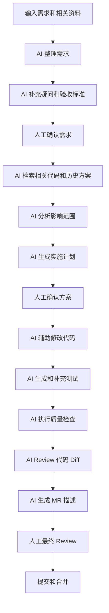

# 用 AI 工具重构研发工作流试点方案

## 一、项目背景

目前 AI 已经能够辅助代码生成、文档整理、测试编写和问题分析，但在实际研发过程中，AI 的使用仍以个人尝试为主，缺少统一的上下文、流程和质量标准。

当前研发效率的瓶颈也不只存在于编码阶段。一个需求从进入研发到最终上线，中间还包含大量信息整理、代码检索、方案确认、测试验证、Code Review 和问题定位工作。

因此，本项目希望围绕实际研发流程进行小范围试点，不是单独增加一个 AI 工具，而是探索如何让 AI 稳定参与需求分析、方案设计、编码验证和代码提交等环节。

---

# 二、当前研发流程

目前一个前端需求通常经过以下环节：

当前主要使用：

* 产品文档和沟通：飞书
* 设计：Figma
* 开发：VS Code、Codex
* 代码管理：公司内网 GitLab
* 质量检查：ESLint、TypeScript、单元测试（暂无）、E2E（暂无）、CI

以一个修改 5～10 个文件的中型前端需求为例，除编码外，研发人员通常还需要花费较多时间完成：

* 阅读和整理需求
* 与产品、设计和后端确认
* 搜索相关代码和历史实现
* 分析影响范围
* 补充测试
* 处理类型和 CI 问题
* 整理 Merge Request 描述
* 修改 Code Review 意见

这意味着研发效率提升不能只关注“写代码更快”，还需要优化编码前后的整个协作过程。

---

# 三、当前核心问题

## 1. 需求信息分散

需求信息可能分布在产品文档、Figma、飞书聊天记录和接口说明中，需要研发人员手工整理。

容易出现：

* 临时补充信息遗漏
* 产品、研发、测试理解不一致
* 开发过程中反复确认
* 测试和 Review 阶段发现边界场景缺失

---

## 2. 项目知识依赖个人经验

代码目录职责、公共组件、历史方案、开发规范和常见问题，大量存在于资深开发者的个人经验中。

新人或 AI 工具通常需要重新搜索和理解，容易出现：

* 重复造轮子
* 使用错误的组件或接口方式
* 新旧实现并存
* 不同开发者形成不同的实现风格

---

## 3. 技术方案缺少标准化过程

中小型需求通常不会单独编写技术方案，研发人员在完成基本分析后直接开始编码。

可能导致：

* 开发过程中不断扩大修改范围
* 公共组件影响评估不足
* 测试范围不明确
* Reviewer 需要重新理解设计思路

---

## 4. 重复性工作占用研发时间

研发过程中存在大量模式相似、但仍需手工完成的工作，例如：

* 页面和组件基础结构
* 表格、表单和请求代码
* 加载、空状态和错误状态
* 国际化文案
* 测试用例
* MR 描述
* CI 报错分析

这些工作技术难度通常不高，但数量较多，容易占用研发人员的有效时间。

---

## 5. AI 使用方式缺少约束

当前直接使用 AI 编码时，结果可能不稳定，例如：

* 不了解项目现有架构
* 绕过已有公共能力
* 修改无关文件
* 使用 `any` 规避类型问题
* 缺少异常场景和测试
* 只完成表面功能

问题的核心不是模型完全没有能力，而是 AI 缺少稳定的项目上下文、执行流程和质量标准。

---

## 6. Review 和研发经验没有形成长期资产

Code Review 中经常重复出现类似问题，例如：

* 文案没有国际化
* 缺少错误状态
* 公共组件修改未分析影响范围
* 缺少必要测试
* 修改了不应人工修改的生成文件

目前这些问题主要依赖 Reviewer 人工发现，没有持续沉淀为 AI 和开发者都可以执行的规则。

---

# 四、AI 改造思路

本项目不以“完全自动开发”为目标，而是建立一套有明确人机分工的半自动研发流程。

AI 主要负责：

* 信息整理
* 代码检索
* 重复工作
* 自动检查
* 风险提示

研发人员继续负责：

* 业务目标判断
* 技术方案取舍
* 高风险变更决策
* 最终代码质量
* 发布决策

目标流程如下：

流程中保留三个必要的人工检查点：

1. 需求理解确认
2. 实施计划确认
3. 最终代码确认

---

# 五、第一阶段试点内容

第一阶段建议优先实现八项能力。

## 1. 需求自动整理

将 PRD、Figma 说明、飞书补充信息和接口说明整理为统一结构：

* 需求目标
* 功能范围
* 用户场景
* 页面和交互变化
* 接口依赖
* 异常场景
* 待确认问题
* 验收标准

---

## 2. 需求疑问和验收标准生成

AI 根据现有需求主动识别信息缺口，例如：

* 搜索条件是否需要保留
* 接口失败时如何展示
* 无权限用户如何处理
* 是否允许重复提交
* 空数据和异常数据如何展示

减少问题在开发后期和测试阶段暴露。

---

## 3. 仓库智能检索

AI 根据需求自动检索：

* 相关页面
* 可复用组件
* 接口调用位置
* 相似历史实现
* 测试文件
* 路由和权限配置

减少开发人员逐个目录搜索代码的时间。

---

## 4. 影响范围分析

当需求修改公共组件、类型或接口时，由 AI 分析：

* 被影响的页面
* 组件引用位置
* 相关测试
* 跨模块依赖
* 建议回归范围

降低修改公共能力时的遗漏风险。

---

## 5. 实施计划生成

编码前由 AI 输出文件级实施方案：

* 需要新增和修改的文件
* 每个文件的修改目的
* 数据流和组件关系
* 测试计划
* 风险和注意事项

由研发人员确认后再进入编码阶段。

---

## 6. 自动质量检查

AI 按固定流程执行并分析：

1. 修改文件范围检查
2. ESLint
3. TypeScript 类型检查
4. 单元测试
5. 模块测试
6. Build
7. 必要的 E2E

检查失败后，输出失败原因、影响文件和修复建议。

---

## 7. Diff 自动 Review

AI 在提交 MR 前进行第一轮检查：

* 是否完成需求
* 是否修改无关文件
* 是否违反项目规范
* 是否重复实现已有能力
* 是否存在空值和异常风险
* 是否通过类型断言绕过问题
* 是否缺少必要测试
* 是否影响公共模块

AI 负责基础检查，Reviewer 可以重点关注业务逻辑、技术方案和长期维护性。

---

## 8. MR 描述生成

根据需求、实施计划、代码 Diff 和测试结果，自动整理：

* 需求背景
* 主要修改
* 影响范围
* 验证结果
* 风险说明
* 回归建议

提升 MR 信息完整度，降低 Reviewer 理解成本。

---

# 六、分阶段推进计划

## 第一阶段：流程标准化

目标：让 AI 能够理解需求和项目。

主要工作：

* 选择一个前端项目作为试点
* 梳理当前研发流程
* 建立需求输入模板
* 整理项目架构和目录说明
* 整理编码、测试和 Review 规则
* 建立基础效果指标

这一阶段主要解决“AI 不理解项目”的问题。

---

## 第二阶段：个人工作流试点

目标：在真实需求中验证 AI 工作流。

优先试点：

* 中小型页面需求
* 表格和表单修改
* 常规接口接入
* Bug 修复
* 测试补充
* MR 描述生成
* CI 错误分析

这一阶段不自动合并代码，也不自动发布生产环境。

---

## 第三阶段：团队级沉淀

目标：把个人有效经验转化为团队能力。

主要工作：

* 整理高频 Review 意见
* 建立统一 AI Skills
* 形成项目级上下文规范
* 建立需求、方案和 MR 模板
* 统计 AI 采纳率和返工情况
* 扩展到更多项目和开发者

---

## 第四阶段：平台化评估

当工作流已经在多个项目中证明有效后，再评估是否需要建设统一平台，包括：

* GitLab 集成
* 飞书需求接入
* 项目知识检索
* AI 任务编排
* 权限和安全控制
* 模型使用成本统计
* 研发效能数据分析

避免在真实场景尚未验证前，直接投入建设大型平台。

---

# 七、试点范围

## 建议纳入

* 中小型前端需求
* 页面新增和修改
* 表格及表单功能
* 常规接口接入
* 测试补充
* Bug 修复
* MR 描述
* CI 错误分析

## 暂不纳入

* 核心架构重构
* 大规模依赖升级
* 数据库变更
* 权限体系调整
* 自动合并代码
* 自动发布生产环境
* 缺少验收标准的复杂需求
* 涉及多个团队的大型项目

---

# 八、预期收益

## 1. 提升研发效率

预计可以减少：

* 需求信息整理时间
* 代码检索时间
* 重复代码编写时间
* 本地检查和 CI 定位时间
* MR 描述整理时间
* 基础 Review 时间

---

## 2. 提高交付质量

通过统一需求结构、验收标准和自动质量检查，降低：

* 边界场景遗漏
* 项目规范遗漏
* 无关代码修改
* 测试覆盖不足
* 公共组件修改风险
* 同类问题重复发生

---

## 3. 降低团队知识传递成本

将项目架构、目录规则、历史经验和 Review 意见转化为结构化文档和 AI 规则。

降低研发对个人经验的依赖，帮助新成员更快理解项目。

---

## 4. 提高 Review 有效性

让 AI 处理命名、规范、测试遗漏和明显风险等基础问题。

Reviewer 可以将更多时间投入到：

* 业务逻辑
* 架构合理性
* 长期维护成本
* 潜在业务风险

---

## 5. 为后续平台化提供真实依据

通过试点积累数据，判断：

* 哪些环节适合 AI
* 哪些环节仍然必须人工完成
* AI 实际节省了多少时间
* 哪类需求使用 AI 后效果最好
* 是否值得进一步投入平台建设

---

# 九、试点成功标准

建议试运行四周，记录以下指标：

| 指标              |  当前基线 |    试点目标 |
| --------------- | ----: | ------: |
| 需求整理时间          | 30 分钟 | 10 分钟以内 |
| 代码搜索时间          | 40 分钟 | 15 分钟以内 |
| MR 描述时间         | 20 分钟 |  5 分钟以内 |
| 首次 CI 通过率       |   待统计 |  提升 20% |
| 平均 Review 轮次    |   待统计 |  降低 20% |
| 基础规范类 Review 意见 |   待统计 |  降低 30% |
| AI 生成代码人工重写率    |   待统计 |  低于 30% |
| AI 方案人工采纳率      |   待统计 |  高于 70% |

同时关注一个重要原则：

> AI 生成代码数量不是核心指标，交付周期、返工率、Review 成本和上线质量才是衡量研发效率的主要依据。

---

# 十、建议决策

建议先选择一个前端项目，进行为期四周的小范围试点。

试点阶段不建设独立的大型平台，优先通过现有的 VS Code、Codex、GitLab 和项目文档完成流程验证。

四周后根据实际数据决定：

* 是否扩大试点团队
* 是否接入更多 GitLab 能力
* 是否建立统一的项目知识库
* 是否开发团队级 AI Skills
* 是否进一步建设 AI 研发效能平台

第一阶段的核心目标是：

> 用最小成本验证 AI 是否能够稳定降低研发过程中的信息整理、代码检索、重复操作和基础检查成本，同时保证代码质量和人工决策权。
