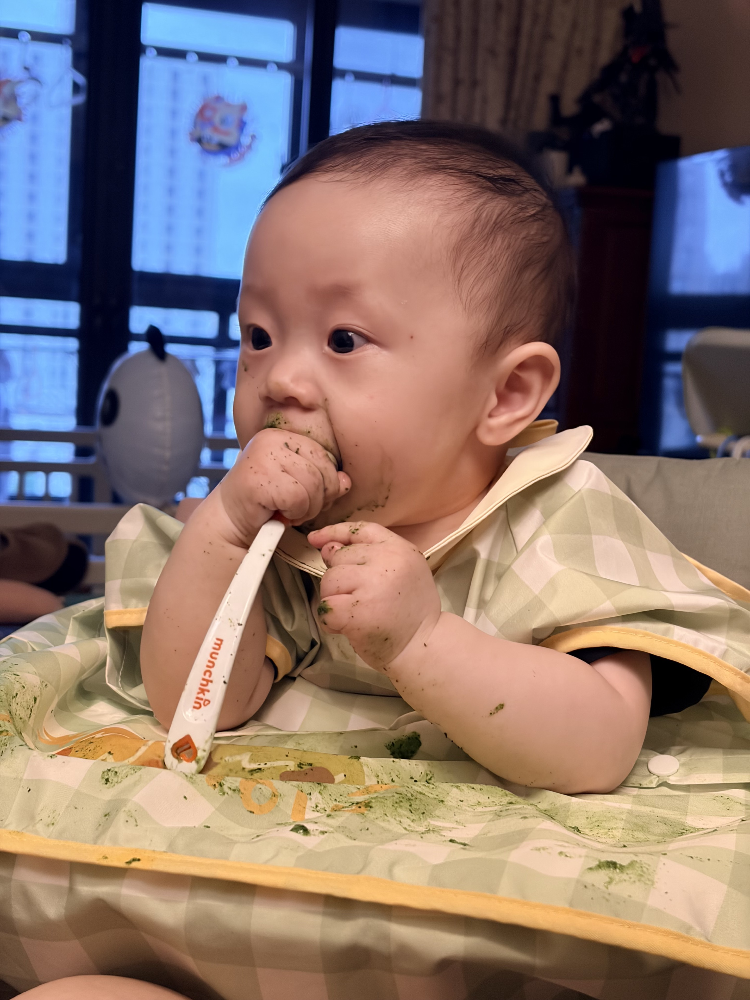
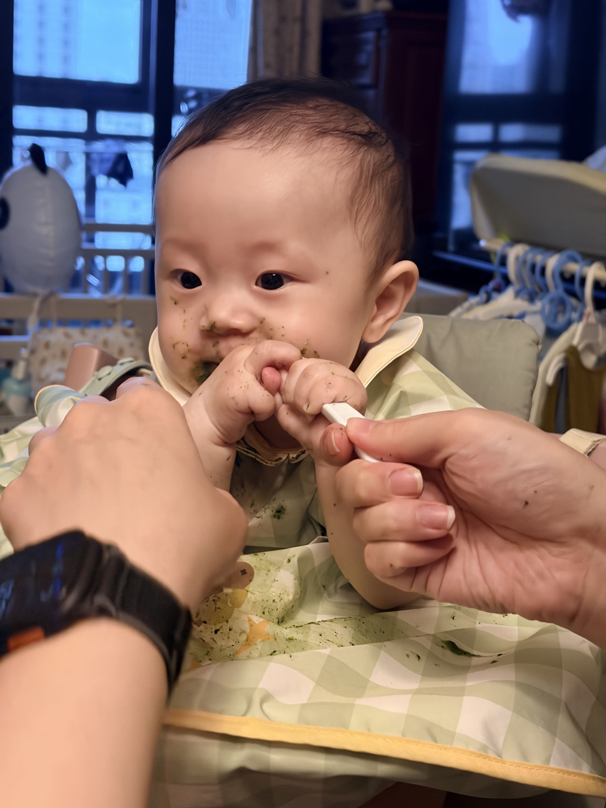
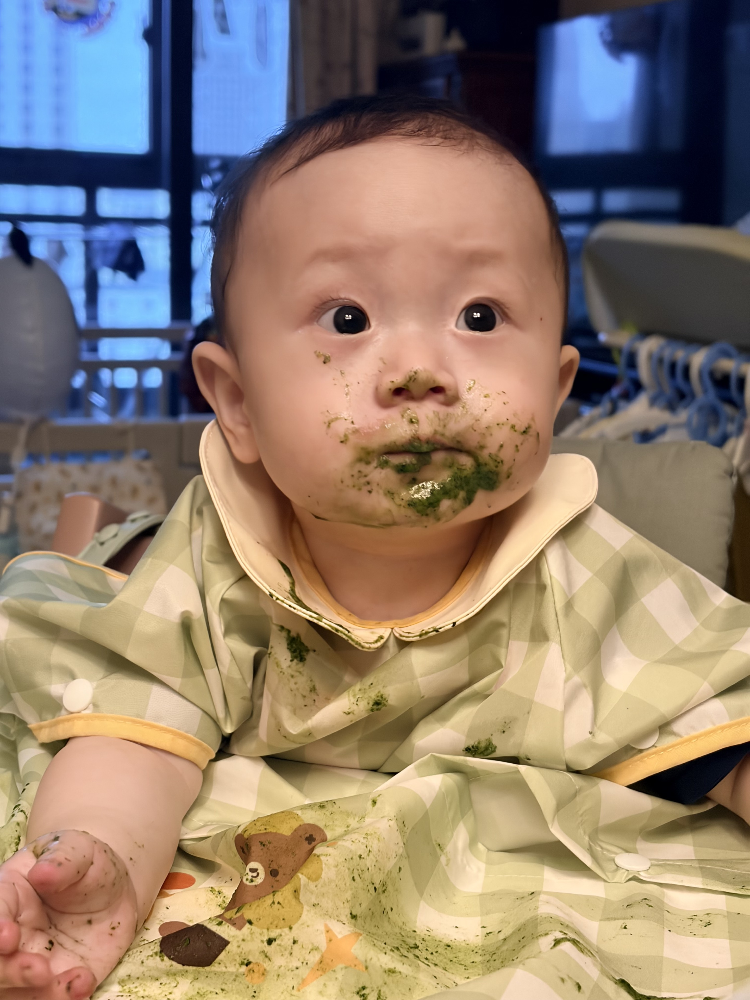

# Tommy 的菠菜小胡子

## 当下

今天 Tommy 吃菠菜，吃着吃着把自己吃成了一个绿色小胡子。

他一边认真吃，一边开始抢勺子，好像突然明白了：原来这个东西可以自己掌控。手上、脸上、围兜上到处都是菠菜，现场有点乱，但很好笑。

## 抢勺子

喂到一半，他开始不满足于等着被喂，伸手就要抢勺子。两只小手一起上，脸上还挂着菠菜泥，表情却很认真。

## 菠菜小胡子

最后菠菜糊到了嘴边、鼻子下、下巴上，真的像长出了一圈小胡子。看着他一本正经的样子，更像是在认真完成一件大事。

## 记录

晚上又给 Tommy 剃头了，剃完以后一下子变成了小和尚。

今天留下的是两个变化：白天他开始抢勺子，晚上他换了一个新发型。一个是想自己来的小动作，一个是突然变得更圆、更亮的小脑袋。
